# Gesture-Controlled Volleyball Scoreboard

A portable, battery-powered LED scoreboard I designed and built from scratch, and taught to keep score by watching the players. A **Raspberry Pi 4** runs a pose-estimation neural network on a wide-angle camera at the net. When a player holds a **T-pose**, their team gets a point. Hands on top of the head (the "surrender cobra") takes the point back. An **Arduino Mega** owns the score, drives 252 addressable LEDs, plays voice clips from an SD card, and keeps working with its physical buttons whether or not the Pi is running.

-ff6f00?style=flat-square)

  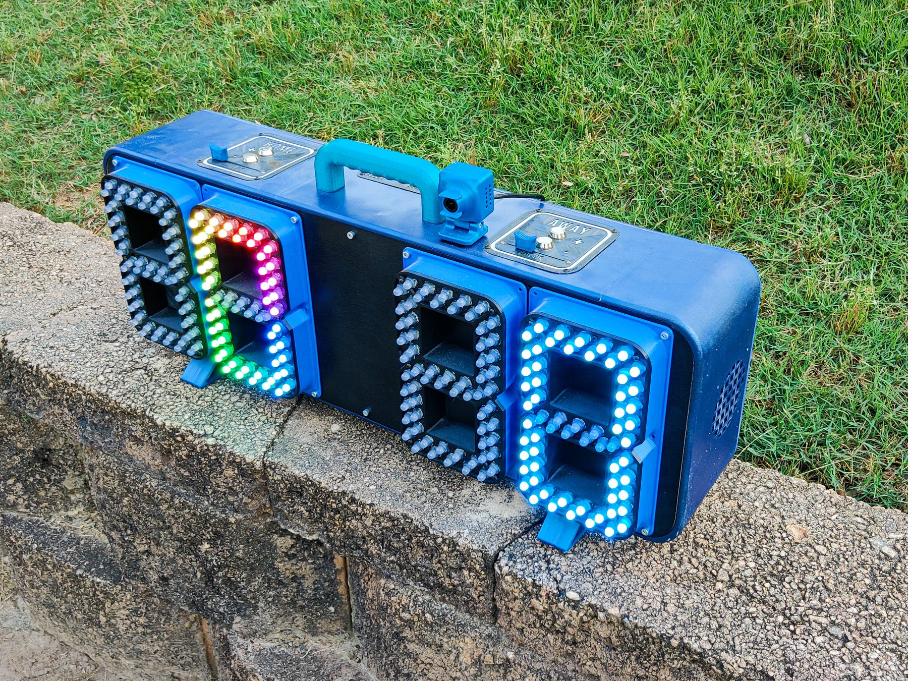

<!-- 🎬 HERO GIF: when media/video/tpose-scores-a-point.gif exists (see "Claude deleteme.md" → Shot list), uncomment the next line.

-->

## Engineering skills on display

| Domain | What I built |
|---|---|
| **Edge ML & computer vision** | MoveNet MultiPose (TFLite, float16) on a Pi 4 CPU at ~2.9 fps. Two overlapping half-frame passes to track up to 12 players with a 6-person model, rule-based gesture recognition in pixel space, a live-fitted lens keystone model |
| **Embedded firmware** | Arduino Mega 2560 (C++): score and game logic, FastLED driving 252 WS2812B LEDs, 8-bit WAV playback from SD (TMRpcm), analog slide pots, I²C LCD, multi-button chords for menus, heartbeat-gated trust in the Pi |
| **Electrical & power** | Ryobi 18V tool-battery power, fused distribution, high-current 5V buck rail for the LEDs, Pi and Arduino, panel voltage and current meters, 3.3V→5V logic interfacing, a dozen hand-wired GPIO and data runs |
| **Mechanical & CAD** | Full enclosure designed in Fusion 360 and 3D-printed: segment carriers, battery dock, camera mount, vents and fan duct, service door, handle |
| **Linux reliability** | systemd service with watchdogs, camera hot-plug recovery, power-cut-safe file writes, boot-time tuning, remote deploys with automatic rollback |
| **Testing with real data** | Field-capture logging of every scored point, offline replay of saved keypoints to tune the rules, false-positive regression on recorded games, fault injection, soak testing |

## How it works

<picture>
  <source media="(prefers-color-scheme: dark)" srcset="media/diagrams/architecture-dark.svg">
  
</picture>

The split is deliberate. **The Arduino is in charge.** It holds the score, and the five physical buttons always work. The Pi only *suggests* points, over five GPIO lines: +1 and −1 for each team, plus a heartbeat. The Arduino accepts those pulses only while the heartbeat is steady, and it announces when the Pi connects or drops out. If the camera fails, the Pi crashes, or it's simply left at home, the scoreboard is still a scoreboard.

1. **Camera:** a wide-angle USB camera sits low at the net post, looking along the net so it sees both teams. Frames arrive as hardware MJPG at 1280×720, read by a threaded grabber that always hands over the newest frame.
2. **Two passes:** each frame is split into a home half and an away half that overlap by 12% around the net line, and each half goes through MoveNet MultiPose separately.
3. **Rules:** every detected player is checked for a T-pose or a cobra in true pixel geometry. A T-pose has to appear in 2 of the last 3 frames, and a cobra has to be held for 0.8s.
4. **Point:** the Pi sends a 50ms pulse on that team's line. The Arduino adds the point, re-draws the digits and plays the point sound.

## The build

| | |
|:---:|:---:|
| 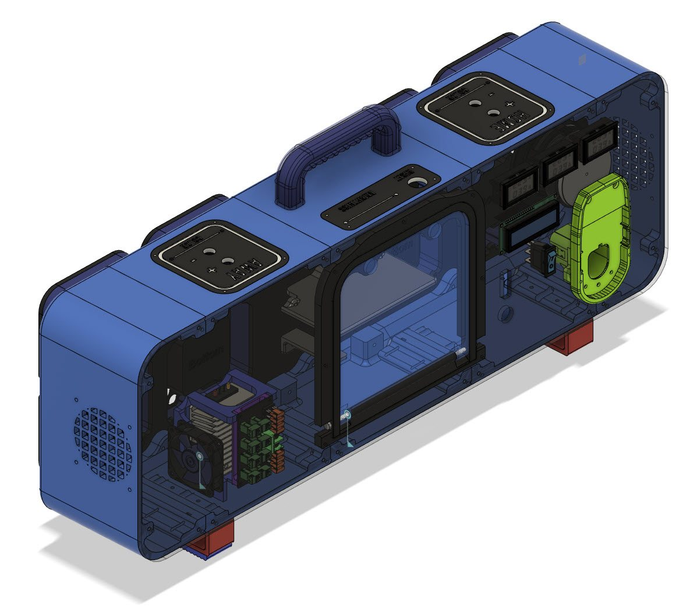 | 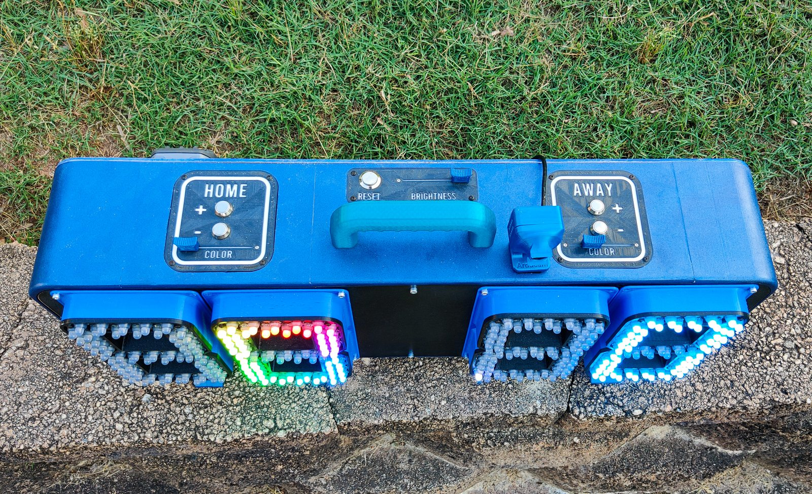 |
| *Designed in Fusion 360 first: every internal part has a printed mount* | *Top controls: + / − per team, color sliders, reset and brightness* |
| 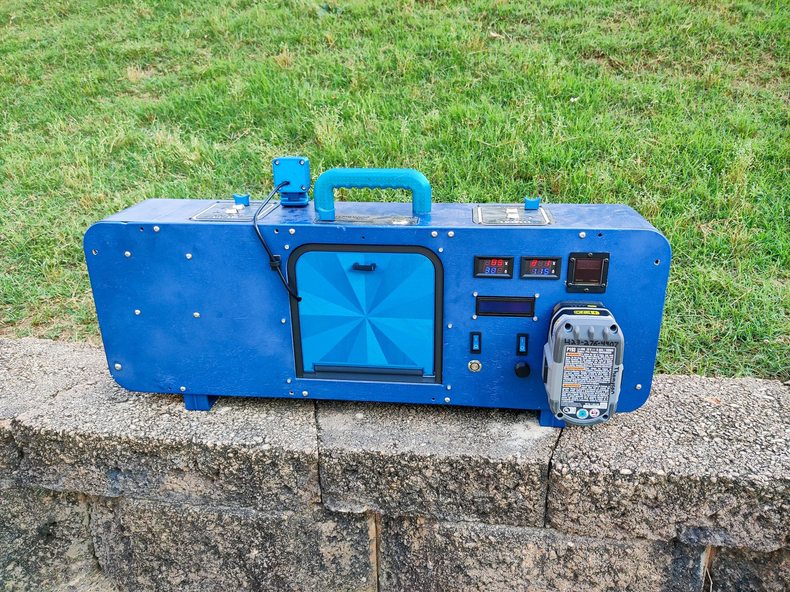 | 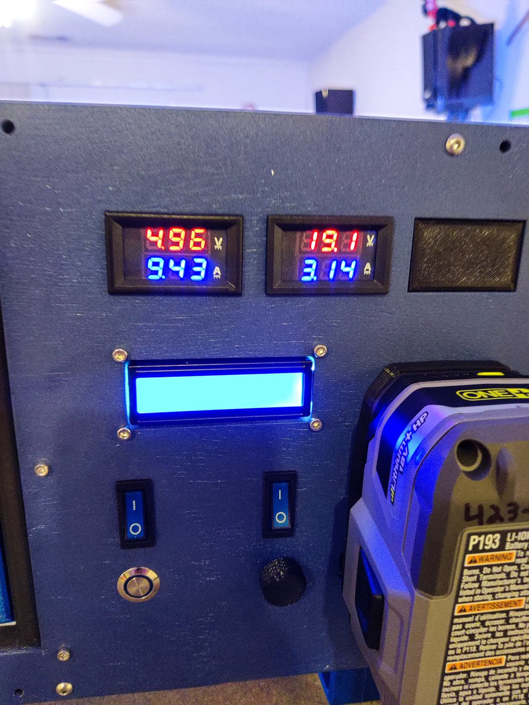 |
| *Rear: speaker, power panel and a Ryobi 18V tool battery* | *Live meters for the 5V rail and the battery (here 9.4A at 5V with the LEDs lit)* |
| 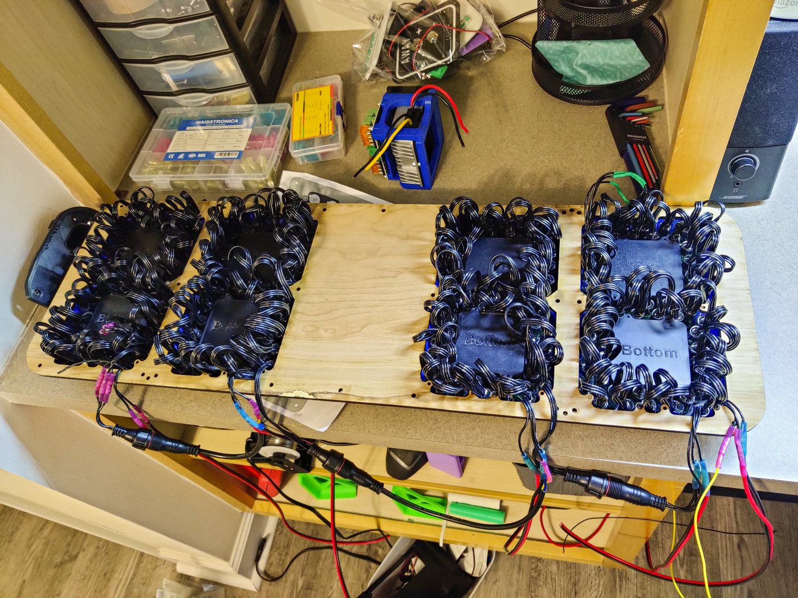 | 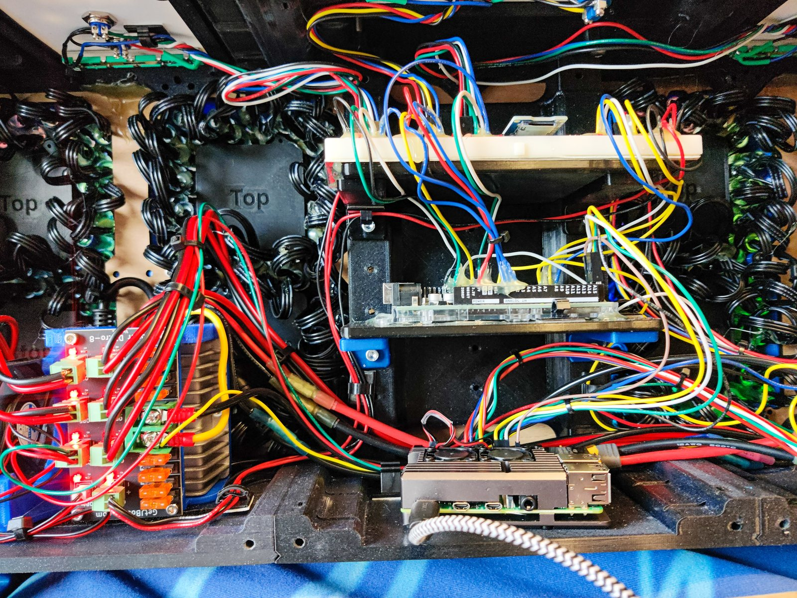 |
| *Each digit is 7 segments × 9 LEDs, strung by hand into printed carriers* | *Inside: power distribution (left), Arduino Mega (shelf) and the Pi (bottom)* |
| 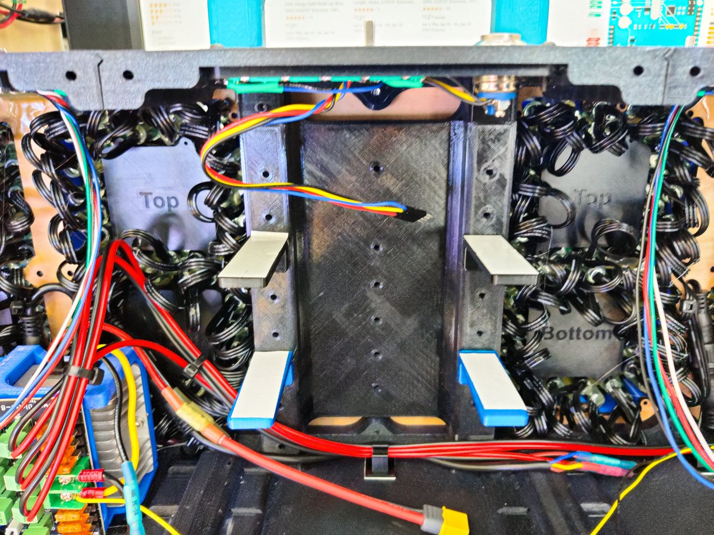 | 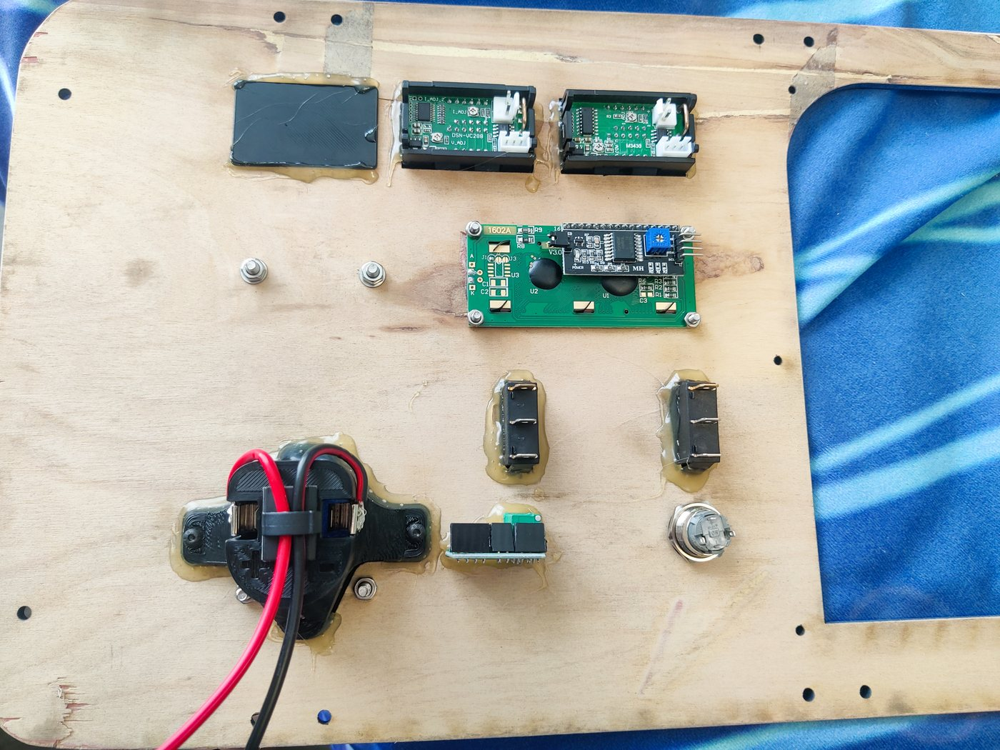 |
| *Digit carriers going into the shell, data and power run along the spine* | *Rear panel laid out in plywood first, then printed* |
| 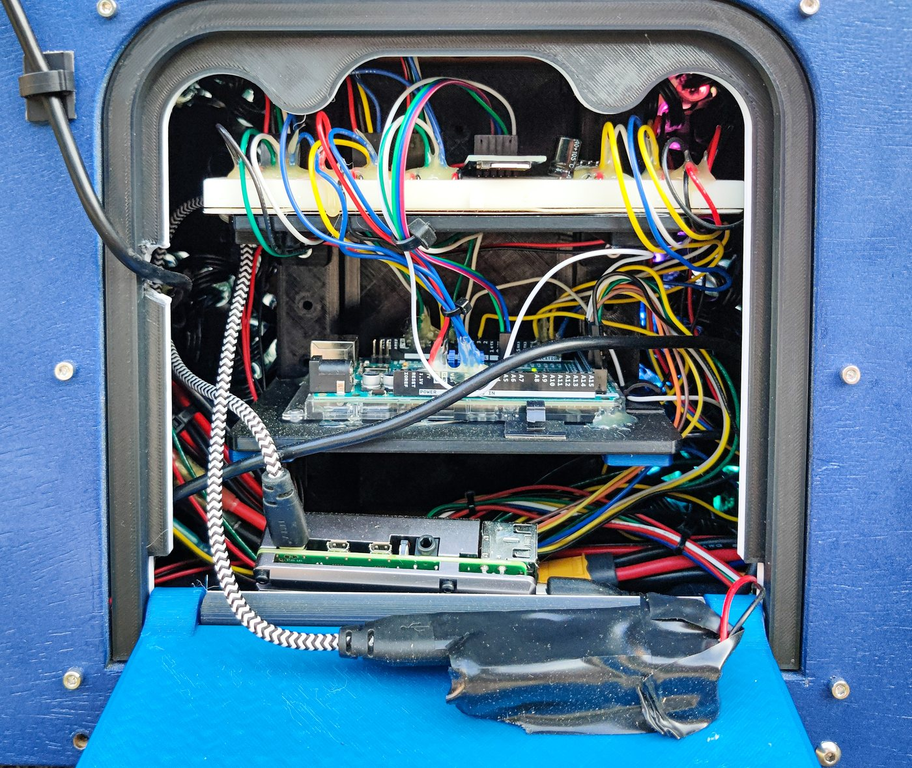 | 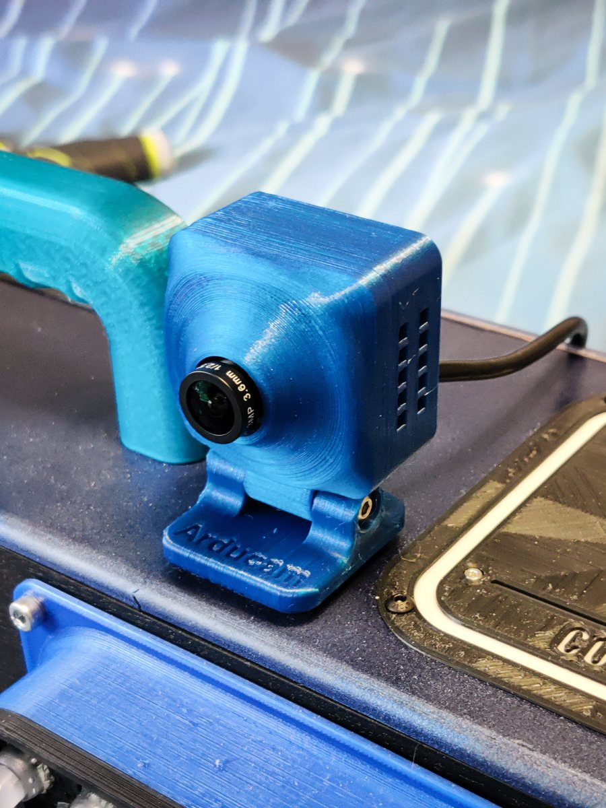 |
| *Service door open: everything stays reachable for repairs at the court* | *The camera in its printed, hinged housing* |

<!-- 📸 PHOTO SLOTS (see "Claude deleteme.md" → Shot list). Uncomment each row as the photo lands in media/.
|  |  |
| *Power: battery input, fuses and the 5V buck converter* | *The Pi-to-Arduino signal harness* |
|  |  |
| *OLED aim assist: line the far net post up with the yellow line* | *At the court* |
-->

The enclosure is entirely 3D-printed. It has a carry handle, a hinged camera mount, vents and a cooling fan, a printed dock for a standard Ryobi 18V battery, and a service door. The power path runs from the battery through an XT60 connector and fuses to a high-current 5V buck converter. That one 5V rail feeds the LEDs (about 9.4A when bright), the Arduino and the Pi. Panel meters show the battery and the 5V rail live, which made checking the LED current budget easy in the field.

## What it does

- **Scores points from gestures:** T-pose for +1, the hands-on-head "surrender cobra" for −1 (to undo a mistake). Each team's side is decided by the player's **torso center**, so reaching over the net never scores for the other team.
- **Handles up to 12 players** (6v6) even though MoveNet MultiPose returns at most 6 people per image. [How →](#the-hard-parts)
- **Manual control always works:** + / − buttons per team, reset, brightness and per-team color sliders (including a rainbow mode). Button chords change settings: 2 buttons cycles game-to 21 / 25 / 15, 3 toggles voice or beeps, 4 switches between volleyball and **tennis scoring** (15 / 30 / 40, deuce and advantage spelled out on the 7-segment digits).
- **Talks:** voice clips for every point, undo, reset and mode change, a connect and disconnect announcement for the Pi, and a victory song when a team wins by 2.
- **Aims itself:** for the first 5 minutes after boot, a small OLED shows the camera view with the current net line, so the camera can be lined up with the far post.
- **Logs its own decisions:** every scored point saves the 20 frames before and 6 after with each player's skeleton and the exact rule values that passed or failed, so the rules can be tuned from real games.
- **Runs unattended:** it starts on power-up with no network, survives camera unplugs and power cuts, and shuts down cleanly from a held button.

## The hard parts

### 12 players from a 6-person model

MoveNet MultiPose returns at most **6 people** per image. A 6v6 game has 12 players, and a back-row player calling a point is exactly who a single pass drops. Each frame is split at the net line into two halves that **overlap by 12%**, and each half gets its own pass, so each team gets the model's full 6-person capacity. The overlap means an arm stretched across the net is never cropped off. Each pass then keeps only the people whose torso centroid is on its own side of the net line, so someone visible in both halves is checked exactly once, for the team they're standing with.

  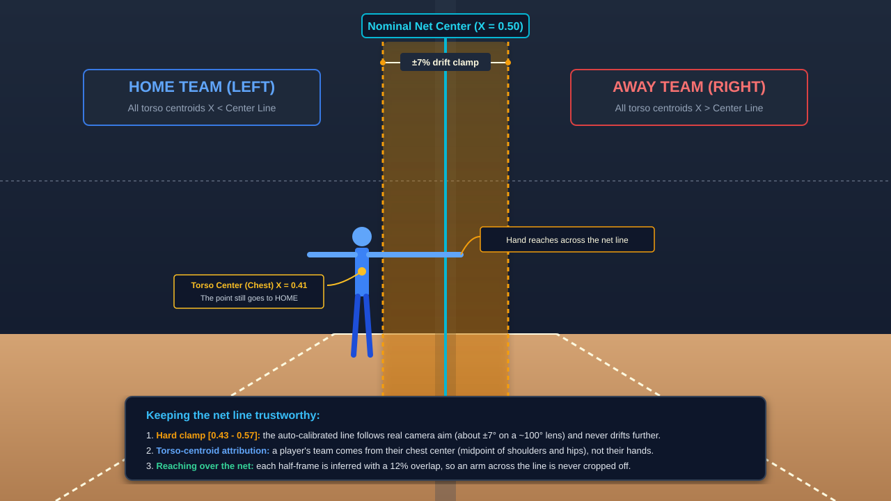

The net line calibrates itself from the median positions of upright players on each side, smoothed over 30s windows, and is **hard-clamped to ±7%** of frame center so a timeout huddle on one side can't drag it away.

### A wide-angle camera sitting on the ground

The camera sits low and looks slightly up through a ~100° lens. That breaks naive pose geometry in three ways, all found by replaying logged points frame by frame:

- **Keystone lean.** Upright people near the frame edges appear to lean outward, measured at about **−28° × (x − 0.5) + 2.4°**: roughly 10° at each edge. Real T-poses at the sideline failed the tilt check for 1.5s. A `KeystoneEstimator` re-fits that lean every 60s from upright people in view and subtracts it. It's only ever applied when it makes the check *more* lenient, so a bad fit can't block a real point.
- **Tilt-proof arm checks.** "Arms level" is measured along the player's own hip→shoulder axis instead of image vertical, and arms must be 90° ± 20° to the spine. That makes the check immune to a camera tilted on uneven sand.
- **Close players losing their heads.** Within ~2m of the camera, heads leave the frame and MoveNet mirrors left and right or loses a wrist. A T-pose is symmetric, so swapped labels are swapped back. One missing wrist is projected as a straight forearm from the elbow when the other arm is complete.

| | |
|:---:|:---:|
| 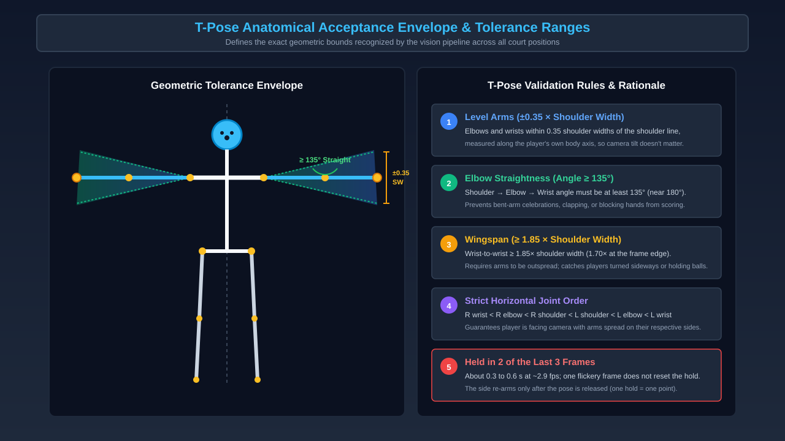 | 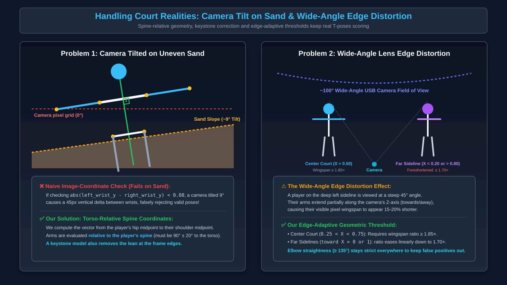 |

**Result:** replaying 22 logged events, the new rules accepted **151 T-pose frames vs 80** before, losing none, and most points would have confirmed 2–3s sooner. Running the old and new rules on **392 recorded game frames** plus all indoor test footage, the new rules added 22 accepted frames and dropped none, and every added frame was a genuine T-pose.

<!-- 📸 DETECTION FRAME: a logged PoseEvent frame (skeleton, measured values, 2-of-3 window) belongs here. Candidates are in _private/candidate-media/.

-->

### Running unattended on a battery at a beach

Nobody can SSH into it mid-game, so it has to recover from everything by itself:

- **Camera hot-plug.** The USB camera dropped off the bus several times during boot and once mid-game (USB `error -71`, with no undervoltage). The camera is now opened by its stable `/dev/v4l/by-id` path rather than `/dev/video0`, because it came back as `video1` and the old code kept retrying the wrong device. Bit-identical frames for 5s mean a hung camera, which gets re-opened. Frames older than 2s are refused, so a frozen image can never re-score. Verified with a software USB unbind and rebind: it recovers in about 12s.
- **Heartbeat semantics.** A dedicated thread toggles the heartbeat every 1.0s, but only while the main loop is processing live frames, so "Pi connected" on the Arduino really means "vision is working".
- **Watchdogs.** If the main loop stops for 60s the process exits, and systemd restarts it. The camera thread catches any exception, releases the device and re-opens it.
- **Power cuts.** It gets switched off at the battery. Every capture is written to a `.tmp` file, `fsync`ed, then atomically renamed, and leftover temp files are cleaned at start-up. The Pi has no clock battery, so time jumps by hours once NTP syncs. All interval timing uses `time.monotonic()`, and capture files carry a session counter instead of trusting the wall clock.
- **Bounded everything.** There's a 5GB capture cap with oldest-first rotation (scored points are kept), a stop-writing threshold at 2GB free, and bounded queues. Memory stayed flat at about 203MB over long runs.
- **Boot.** Live detection starts about 14s after the kernel starts. The service no longer waits for the network, Bluetooth initialization is disabled, and cold imports are the remaining cost.

### An embedded bug worth remembering

The Arduino decides whether the Pi is alive by comparing heartbeat periods: `this < prev + range && this > prev - range`. An intermediate firmware made those periods `unsigned long`. With a 1s heartbeat and a 700ms range, `prev - range` is fine, but for any period under 700ms it **wraps to about 4.29 billion**, so no period ever matched. The Pi was declared disconnected about 7s after every connect. The fix is signed 32-bit `long` periods, plus a debounce of 3 consecutive irregular beats before declaring a disconnect, and an instant first connect on boot.

## Measured

| | Result |
|---|---|
| Vision loop (two MoveNet passes + rules) | **~340ms per frame (~2.9 fps)** on a Pi 4, 3 inference threads |
| Hold-to-point latency | 2 of 3 frames ≈ **0.3–0.6s** once the pose is held |
| Players tracked | up to **12** (6 per half) |
| Boot to live detection | **~14s** after kernel start |
| Camera USB drop-out → frames again | **~12s**, automatic |
| Memory over a long run | flat at **~203MB** RSS |
| Rule rework on 22 logged events | **151 vs 80** accepted frames, 0 lost |
| False-positive check (392 game frames + indoor footage) | 0 accepted frames lost, 22 added, all genuine |

## Wiring

  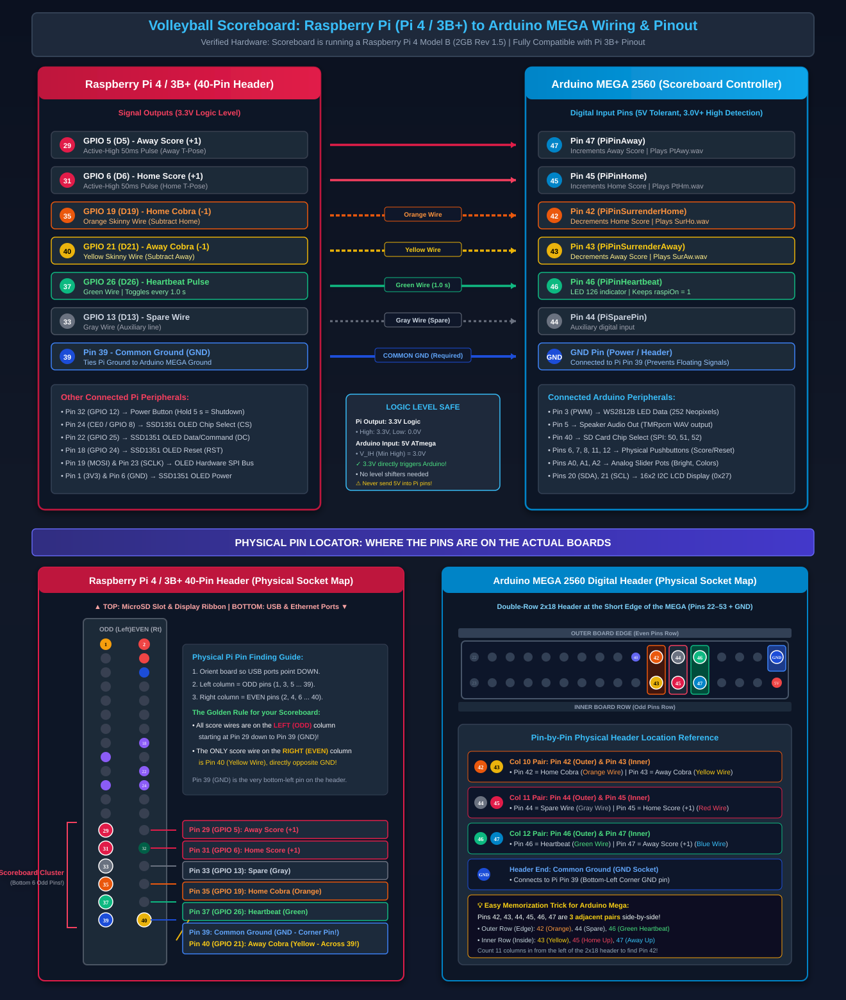

| Signal | Pi pin (BCM) | Mega pin | Notes |
|---|---|---|---|
| Away +1 | 29 (GPIO 5) | 47 | 50ms active-high pulse |
| Home +1 | 31 (GPIO 6) | 45 | 50ms active-high pulse |
| Home −1 (cobra) | 35 (GPIO 19) | 42 | |
| Away −1 (cobra) | 40 (GPIO 21) | 43 | |
| Heartbeat | 37 (GPIO 26) | 46 | toggles every 1.0s while vision is live |
| Spare | 33 (GPIO 13) | 44 | reserved |
| Ground | 39 | GND | common ground is mandatory |
| **Phone link: state in** (pink) | 28 (GPIO 1, RXD2) | 14 (TX3) | via a 5.1k/10k divider (the Mega TX is 5V). Phone display, not deployed yet |
| **Phone link: commands out** (pink) | 27 (GPIO 0, TXD2) | 15 (RX3) | via 1k. Future phone control |

The Pi's 3.3V outputs drive the Mega's 5V inputs directly: 3.3V clears the ATmega2560's 3.0V input-high threshold, and nothing ever drives 5V back into the Pi. Locally on the Pi there's also an SSD1351 RGB OLED on SPI and a power button (hold 5s to shut down). Full details are in [`pi/README.md`](pi/README.md) and [`arduino/README.md`](arduino/README.md). To set up a Pi from a blank SD card (including how everything starts on boot), see [`docs/pi-setup-from-scratch.md`](docs/pi-setup-from-scratch.md).

## What's next: the score on my phone

The Pi only ever sends +1 / −1, so today it doesn't know the score. The next step:

1. The Arduino broadcasts its full state over a new one-way UART link to the Pi's second PL011 serial port. It never waits for an answer, so it still works with no Pi.
2. The Pi publishes the score as a **Bluetooth LE** GATT service.
3. A **Web Bluetooth** page in Chrome on my phone shows it in huge digits courtside, with no Wi-Fi needed. Phone control (+1 / −1) comes after that.

The firmware, the Pi service and the page are written and bench-tested (the page runs in demo mode). Deploying needs two new wires and a boot-config change, so it waits for physical access. The plan, wiring and deploy checklist are in [`docs/phone-display-plan.md`](docs/phone-display-plan.md), and the page is in [`web/`](web/).

## Repository layout

| Folder | What's in it |
|---|---|
| [`pi/`](pi/) | The vision engine as deployed: `PoseEstimationJT_Optimized.py`, the OLED helper, the TFLite model, the systemd unit and a `/boot/config.txt` snapshot |
| [`arduino/`](arduino/) | The Mega 2560 scoreboard firmware |
| [`legacy/`](legacy/) | The original 2022 Pi script, kept for comparison |
| [`web/`](web/) | The phone display: a Web Bluetooth page (bold seven-segment digits, day and night themes, team colors) |
| [`tests/`](tests/) | Wire-contract tests that keep the Arduino line format, the Pi's BLE packet and the page's decoder in sync |
| [`docs/`](docs/) | The engineering log (every measurement and decision, in order) and the phone-display plan |
| [`tools/`](tools/) | `clean_wavs.py` (de-hiss, trim and normalize the SD-card voice clips) and the source for the architecture diagram |
| `media/` | Photos, diagrams, screenshots |

## History

Version 1 was built over the 2021–22 winter: the enclosure, the LED digits, the Arduino firmware, and a first Pi script that checked the left half of the court, then the right half only if the left had no T-pose (one MoveNet pass each, so at most 6 people per side, and no recovery from crashes). In 2026 I rebuilt the vision side for real games: 12-player coverage, the wide-angle geometry fixes, the reliability work, field logging and boot tuning. The 2022 script is in [`legacy/`](legacy/) for comparison.

## License

MIT. See [`LICENSE`](LICENSE). The MoveNet model is Apache 2.0 (see [`pi/README.md`](pi/README.md)).
